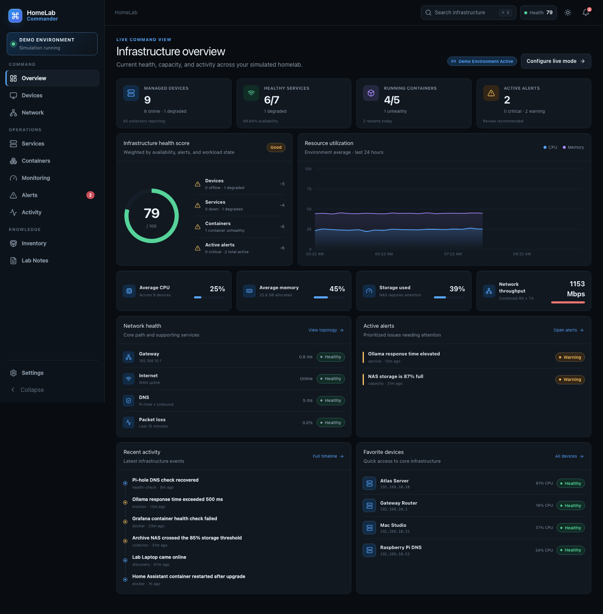
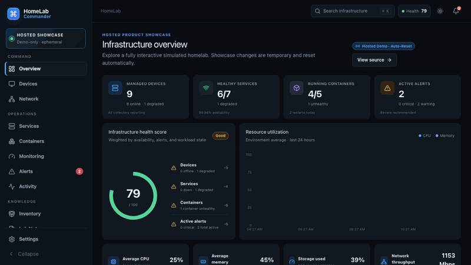
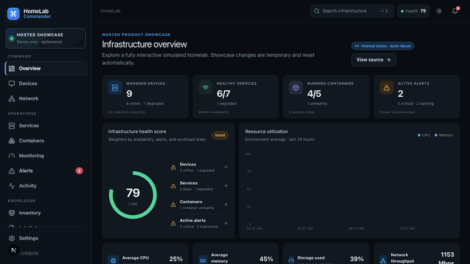
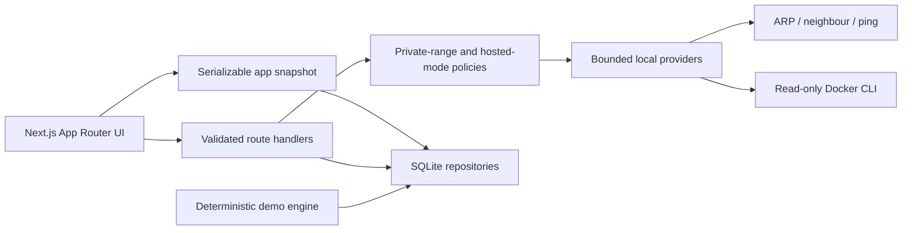

<div align="center">

# HomeLab Commander

**Your infrastructure. One command center.**

A local-first operations console for discovering, monitoring, organizing, documenting, and troubleshooting a personally owned homelab.

[](https://home-lab-commander.vercel.app)
[](https://github.com/chadkraus87/home-lab-commander/actions/workflows/ci.yml)
[](LICENSE)



</div>

## Live showcase

Explore the public app at **[home-lab-commander.vercel.app](https://home-lab-commander.vercel.app)**. It opens in a clearly labeled Hosted Demo with a complete simulated lab—no account, credentials, or setup required.

The hosted deployment is intentionally different from a local installation:

| Capability                                                | Hosted Demo |   Local installation    |
| --------------------------------------------------------- | :---------: | :---------------------: |
| Deterministic, evolving lab telemetry                     |      ✓      |            ✓            |
| Devices, services, topology, alerts, inventory, and notes |      ✓      |            ✓            |
| Interactive demo mutations and reset                      | ✓, this tab |      ✓, persistent      |
| Portable JSON export                                      |      ✓      |            ✓            |
| Portable JSON import                                      |      —      |            ✓            |
| Private-network discovery and diagnostics                 |      —      | ✓, approved ranges only |
| Read-only local Docker inventory                          |      —      |        ✓, opt-in        |

Vercel cannot reach a visitor's private network, and the hosted build does not try. Hosted edits are kept in that visitor's browser tab, never written to a shared server database, and reset when the tab closes. Run locally for persistent state and Live Mode.

## Product tours

### Command center, device intelligence, and topology

[](docs/media/command-center-tour.webm)

[Watch the full-resolution WebM tour](docs/media/command-center-tour.webm)

### Alert response and Markdown runbook workflow

[](docs/media/operator-workflow-tour.webm)

[Watch the full-resolution WebM tour](docs/media/operator-workflow-tour.webm)

The media is reproducible: start the hosted-demo profile locally, then run `npm run media:capture`.

## What it does

- **Command overview** — explainable environment health, live capacity, active alerts, recent activity, favorites, and network status.
- **Device intelligence** — searchable table/card views, persistent notes and tags, interfaces, workloads, events, resource history, and predefined safe diagnostics.
- **Network topology** — interactive XYFlow graph with filtering, detail panels, minimap, pan/zoom, automatic layout, and browser-saved positions.
- **Service monitoring** — normalized HTTP, HTTPS, TCP, and DNS monitors with response time and availability history.
- **Container visibility** — read-only Docker detection and normalized state, with a complete simulated runtime when Docker is absent.
- **Monitoring and alerts** — historical charts, retention and rollups, alert fingerprints, acknowledgement, resolution, and history.
- **Inventory and knowledge** — hardware records plus fast Markdown lab notes with GitHub Flavored Markdown preview.
- **Fast navigation** — unified `⌘ K` / `Ctrl K` infrastructure search and command palette.
- **Polished interaction** — dark/light themes, responsive navigation, keyboard support, visible focus, and reduced-motion support.
- **Safe activation** — guided Live Mode that shows the exact private-network boundary before any active operation.

## Architecture

HomeLab Commander uses Next.js 16 App Router, React 19, strict TypeScript, Tailwind CSS 4, Zod, Node's built-in SQLite driver, XYFlow, Recharts, React Markdown, Vitest, Testing Library, and Playwright.



The application is a single Node process for a personal homelab. Server Components read the repository directly; narrow route handlers validate mutations and provider operations. UI code consumes normalized domain records instead of Docker-, OS-, or vendor-specific output.

See [Architecture](docs/ARCHITECTURE.md), [Security](docs/SECURITY.md), the [2026-08-20 security audit](docs/SECURITY-AUDIT.md), and [Network discovery](docs/NETWORK-DISCOVERY.md) for the complete boundaries.

## Run locally

### Prerequisites

- macOS or Linux
- Node.js 24.x
- npm 11 or newer
- Optional: Docker Desktop or Docker Engine for local container observation
- Optional: `arp`, `ip`, and `ping` for Live Mode discovery

No cloud account, API key, hosted database, or SaaS dependency is required.

### Install

```bash
git clone https://github.com/chadkraus87/home-lab-commander.git
cd home-lab-commander
npm install
npm run dev
```

Open [http://127.0.0.1:3000](http://127.0.0.1:3000). The first request creates `data/homelab.db`, applies append-only migrations, and seeds the Demo Environment. Stop the server with `Ctrl C`.

Development and production scripts bind to loopback by default. Override the hostname only when you deliberately intend to expose the application to a trusted LAN.

### Production build

```bash
npm run build
npm run start
```

Loopback is the safest default. Optional single-operator access control is available through `HOMELAB_ACCESS_TOKEN`; shared or public use still requires authenticated TLS and a separate multi-user authorization design.

### Docker

```bash
docker compose up -d --build
docker compose ps
docker compose logs -f homelab-commander
```

The Compose profile is suitable for an always-on, loopback-only installation. It uses a non-root, read-only application container with dropped capabilities, `no-new-privileges`, resource limits, health checks, log rotation, persistent `homelab-data`, and a network-isolated daily backup sidecar retaining 14 verified snapshots in `homelab-backups`.

On macOS, Docker Desktop's network namespace can limit passive neighbor discovery, and the app intentionally does not mount the host Docker socket. Use the native production process when complete host-LAN discovery and read-only host Docker inventory matter; use Docker when isolation, restart behavior, and manual records/diagnostics matter more. See [Operations](docs/OPERATIONS.md) for startup, backup, access-control, and recovery guidance.

## Demo Mode

Demo Mode is active on first launch. A useful first tour is:

1. Review the health score on **Overview**.
2. Open **Atlas Server** and inspect its resource history and services.
3. Select Atlas in the **Network** topology.
4. Acknowledge an alert and write a Markdown runbook.
5. Use **Settings → Data → Reset Demo** to restore the original lab.

Telemetry evolves deterministically: utilization, latency, throughput, uptime, response times, and events change without ever being presented as real infrastructure data. See [Demo Mode](docs/DEMO-MODE.md).

## Enable Live Mode

1. Open **Settings → Networks** and confirm a private CIDR you own and control.
2. Open **Settings → Environment**.
3. Select the **Live Mode** card; the visible four-step activation setup opens.
4. Choose passive neighbor-table discovery or a rate-limited ping sweep.
5. Review the exact range, operation, and explicit exclusions.
6. Explicitly start discovery, review the results, and choose which devices to add.
7. Optionally use **Settings → Docker** to test the local read-only provider.

Public ranges, unapproved private ranges, and discovery requests larger than one `/24` are rejected. Discovery never performs credential attempts, exploitation, arbitrary commands, or public-internet scanning.

Live Mode pauses simulated telemetry and enables local tools on demand; it does not invent live metrics or silently poll your network. Seed records remain clearly marked as simulated until you replace or supplement them with manual/discovered records.

## Configuration

| Variable                        | Purpose                                                 | Default                          |
| ------------------------------- | ------------------------------------------------------- | -------------------------------- |
| `HOMELAB_DATABASE_PATH`         | Absolute SQLite database location                       | `data/homelab.db`                |
| `HOMELAB_HOSTED_DEMO=1`         | Force the demo-only hosted safety profile               | Off locally; automatic on Vercel |
| `HOMELAB_STANDALONE=1`          | Produce Next.js standalone output for the Docker image  | Off                              |
| `HOMELAB_ACCESS_USERNAME`       | Optional single-operator HTTP Basic username            | `homelab`                        |
| `HOMELAB_ACCESS_TOKEN`          | Optional access token; minimum 24 characters            | Disabled                         |
| `HOMELAB_BACKUP_DIRECTORY`      | Native backup destination                               | `backups`                        |
| `HOMELAB_BACKUP_RETENTION`      | Number of verified SQLite backups retained              | `14`                             |
| `HOMELAB_BACKUP_INTERVAL_HOURS` | Docker backup-sidecar interval, from 0.25 through 168 h | `24`                             |

Hosted mode uses a pristine, temporary server snapshot while visitor changes stay in versioned `sessionStorage`. Direct hosted mutations are rejected, so warm serverless instances cannot leak one visitor's example data to another.

### Backups

Create and integrity-check a native SQLite backup:

```bash
npm run backup
npm run backup:verify -- backups/homelab-YYYYMMDDTHHMMSS.sssZ.db
```

Docker performs this automatically. List or copy its backups with `docker compose exec homelab-backup ls -lh /app/backups` and `docker compose cp homelab-backup:/app/backups ./docker-backups`. Keep an additional copy on another disk; a volume is persistence, not disaster recovery.

## Quality checks

```bash
npm run format:check
npm run lint
npm run typecheck
npm test
npm run test:e2e
npm run build
```

Install Playwright Chromium once if necessary:

```bash
npx playwright install chromium
```

The suite covers private-address enforcement, CIDR validation, hosted-deployment fail-closed behavior, health scoring, alert rules, deterministic simulation, metric downsampling, provider normalization, SQLite workflows, component interaction, and complete browser journeys. GitHub Actions runs static, unit/integration, production-build, and browser checks on pushes and pull requests.

## Deploy your own hosted showcase

[Vercel](https://vercel.com) detects the Next.js application automatically:

1. Fork the repository.
2. Import it into Vercel.
3. Keep the framework preset on **Next.js** and Node.js on **24.x**.
4. Deploy—no environment variables or external database are required for Demo Mode.

The app automatically detects Vercel and enables the hosted safety profile. Do not disable that boundary for a public deployment. A persistent, multi-user hosted edition would require authentication, authorization, durable managed storage, and a secure local agent; those are intentionally outside this release.

## Data and retention

- Local database: `data/homelab.db`
- Raw metrics: retained for the configured interval (30 days by default)
- Older metrics: aggregated into hourly min/max/average rollups before raw rows are removed
- Portable export: devices, services, inventory, notes, and non-secret settings
- Credentials and secrets: never collected or exported

## Security model

HomeLab Commander is defensive and local-first:

- Loopback binding and Demo Mode are the defaults.
- External input is validated with Zod at server boundaries.
- Discovery is restricted to explicitly approved loopback, RFC1918 IPv4, and local-link IPv6 targets.
- OS processes use fixed executable names and argument arrays—never user-built shell commands.
- Discovery and diagnostics are bounded by target limits, timeouts, and rate limits.
- Docker access is read-only and opt-in.
- Vercel deployments fail closed to hosted Demo Mode.
- Hosted edits are browser-tab scoped and server mutations are disabled.
- Optional local access control uses constant-time credential comparison.
- Portable imports are fully schema-validated, size-limited, and reopen in Demo Mode.
- Docker runs non-root with a read-only root filesystem, dropped capabilities, and no host socket.
- No arbitrary terminal, credential attack, public scanning, or unattended disruptive action is exposed.

Review [Security](docs/SECURITY.md) before enabling Live Mode or exposing the local app beyond loopback. Please report security issues privately rather than opening a public issue with sensitive details.

## Project map

```text
src/app          Next.js pages and narrow route handlers
src/components   Shared application shell and UI primitives
src/features     Product-area client experiences
src/domain       Pure models, schemas, calculations, and policies
src/server       SQLite repositories and local providers
src/simulation   Deterministic Demo Mode data and evolution
migrations       Append-only SQLite migrations
tests            Unit, component, and integration coverage
e2e              Playwright user journeys
docs             Architecture, security, discovery, and roadmap notes
```

## Troubleshooting

**Docker is unavailable.** Nothing is broken; Demo container data remains active. Start Docker and check the connection again from a local installation.

**Discovery finds no neighbors.** Passive discovery sees only systems already known to the host. Confirm the approved `/24`, local permissions, and firewall behavior, or try the bounded ping method.

**SQLite cannot open the database.** Confirm the process can create and write the `data` directory or the path configured by `HOMELAB_DATABASE_PATH`.

**Playwright cannot launch.** Run `npx playwright install chromium` and retry.

**Hosted changes disappeared.** That is expected: the public showcase uses ephemeral state. Clone the app for persistent local data.

**Live Mode looked selected but nothing scanned.** Selection now opens a visible four-step setup. No network call is made until you reach step 3 and press **Run discovery**. This is intentional.

**Docker Live discovery is incomplete.** Docker Desktop may not expose the Mac host's neighbor table to the container. Run the production build natively for the fullest local provider access.

## Roadmap and contributing

The current release is an intentionally bounded personal-lab console. Planned work is tracked in [Roadmap](docs/ROADMAP.md) and current implementation detail in [Implementation status](docs/IMPLEMENTATION_STATUS.md).

Issues and focused pull requests are welcome. Keep changes inside the defensive product boundary, include tests for important behavior, preserve accessibility, and run the full quality suite before submitting.

## License

Released under the [MIT License](LICENSE).
