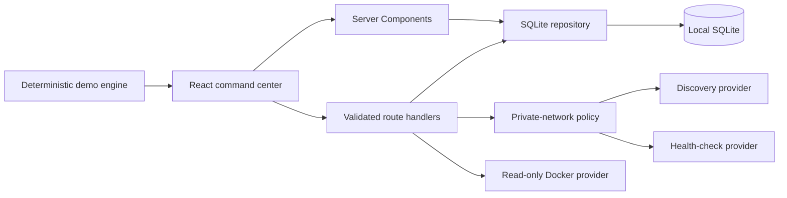

# Architecture

## Goals

HomeLab Commander is a single-user, local-first application. The architecture favors simple operation, transparent data ownership, provider isolation, and secure defaults over distributed-system complexity.

## Runtime shape

The app runs in the default Node.js runtime. It does not use the Edge runtime because SQLite, local networking, and optional operating-system providers require Node APIs.

## Directory responsibilities

- `src/app`: route UI and narrow HTTP boundaries.
- `src/components`: application shell, client providers, command palette, and UI primitives.
- `src/features`: product-area components; each area owns its interaction state.
- `src/domain`: normalized models, Zod schemas, private-network policy, health scoring, alert rules, metric math, and provider interfaces.
- `src/server`: SQLite, migrations, repositories, logging, local discovery, health checks, Docker, and request-origin policy.
- `src/simulation`: deterministic seed data and the evolving Demo engine.
- `migrations`: append-only SQLite schema changes.
- `tests` and `e2e`: domain, component, integration, and browser verification.

## Data flow

The root Server Component loads a serializable `AppSnapshot` directly from SQLite and passes it into a client context. Demo Mode advances a client-side copy on a deterministic timer so UI telemetry feels alive without continuously writing synthetic samples.

Persistent user changes use `/api/state`. The handler enforces same-origin browser mutations, validates a discriminated Zod action, calls one repository method, and returns a complete fresh snapshot. Import, export, discovery, diagnostics, Docker, and health each use dedicated route handlers.

## Database

The schema normalizes devices, interfaces, metrics, services, containers, alerts, events, networks, connections, inventory, notes, and settings. JSON columns are reserved for bounded arrays or flexible metadata, not primary relationships.

SQLite uses WAL mode, foreign keys, a five-second busy timeout, indexed metric/event queries, and transactions for migrations, seeding, import, and Demo reset. Metrics older than the configured raw-retention window are compacted into hourly min/max/average rollups before deletion.

## Provider model

Provider interfaces expose normalized records:

- `DeviceProvider`
- `MetricsProvider`
- `ServiceProvider`
- `ContainerProvider`
- `NetworkDiscoveryProvider`
- `HealthCheckProvider`

The current implementations are the deterministic Demo provider, local neighbor/ping discovery, predefined local diagnostics, and read-only Docker CLI provider. UI components never parse Docker or OS command output.

## Scaling boundary

This release targets one trusted local operator and one process. A multi-user or multi-instance deployment would require authentication, authorization, audit identity, a shared database, shared cache invalidation, background collectors, and stronger cross-host secret management. Those concerns are deliberately outside the current local-first boundary.
