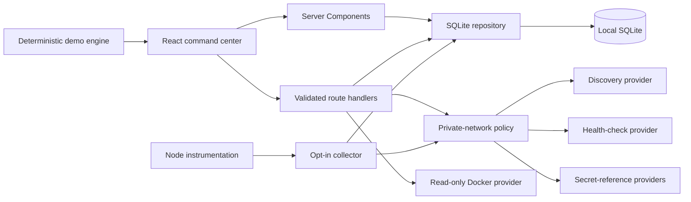

# Architecture

## Goals

HomeLab Commander is a single-user, local-first application. The architecture favors simple operation, transparent data ownership, provider isolation, and secure defaults over distributed-system complexity.

## Runtime shape

The app runs in the default Node.js runtime. It does not use the Edge runtime because SQLite, local networking, and optional operating-system providers require Node APIs.

## Deployment profiles

The same application has two explicit runtime profiles:

- **Local** uses `data/homelab.db`, permits guided Live Mode after user approval, and can call bounded local providers.
- **Hosted Demo** is automatic when `VERCEL=1` or explicit with `HOMELAB_HOSTED_DEMO=1`. The server provides a pristine Demo snapshot, while visitor mutations are reduced and versioned in that browser tab's `sessionStorage`. All server mutation routes, discovery, diagnostics, imports, Docker, provider, collector, Wake-on-LAN, and Live Mode activation fail closed.
- **Docker Compose** uses the Local application profile with loopback port publishing, persistent database and backup volumes, a hardened non-root application container, and a network-isolated backup sidecar.

Migrations are included in Next.js output tracing because the repository reads them from the filesystem at runtime. Hosted SQLite is showcase state only: serverless cold starts and deployments can replace it.

## Directory responsibilities

- `src/app`: route UI and narrow HTTP boundaries.
- `src/components`: application shell, client providers, command palette, and UI primitives.
- `src/features`: product-area components; each area owns its interaction state.
- `src/domain`: normalized models, Zod schemas, private-network policy, health scoring, alert rules, metric math, and provider interfaces.
- `src/server`: SQLite, migrations, repositories, logging, local discovery, health checks, Docker, and request-origin policy.
- `src/simulation`: deterministic seed data and the evolving Demo engine.
- `migrations`: append-only SQLite schema changes.
- `tests` and `e2e`: domain, component, integration, and browser verification.

## Data flow

The root Server Component loads a serializable `AppSnapshot` directly from SQLite and passes it into a client context. Demo Mode advances a client-side copy on a deterministic timer so UI telemetry feels alive without continuously writing synthetic samples.

Persistent local changes use `/api/state`. The handler enforces same-origin browser mutations, validates a discriminated Zod action, calls one repository method, and returns a complete fresh snapshot. Hosted Demo changes use the same schema and a pure client reducer but never call the mutation endpoint. Import, export, discovery, diagnostics, Docker, and health each use dedicated route handlers.

The hosted policy is evaluated server-side. Client controls explain the boundary, but route handlers remain the security enforcement point. Versioned browser-tab state exists only for showcase interactivity and is never trusted by a server operation.

## Database

The schema normalizes devices, interfaces, metrics, services, containers, alerts, events, networks, connections, inventory, notes, and settings. JSON columns are reserved for bounded arrays or flexible metadata, not primary relationships.

SQLite uses WAL mode, foreign keys, a five-second busy timeout, indexed metric/event queries, and transactions for migrations, seeding, import, and Demo reset. Metrics older than the configured raw-retention window are compacted into hourly min/max/average rollups before deletion.

Backups use Node's SQLite online backup API, verify with `PRAGMA integrity_check`, apply owner-only file permissions, and remove only filenames matching the application's versioned backup pattern. Compose runs this in a separate networkless process.

## Provider model

Provider interfaces expose normalized records:

- `DeviceProvider`
- `MetricsProvider`
- `ServiceProvider`
- `ContainerProvider`
- `NetworkDiscoveryProvider`
- `HealthCheckProvider`

The current implementations are the deterministic Demo provider, local neighbor/ping discovery, predefined local diagnostics, read-only Docker CLI provider, and a registry for Prometheus, Proxmox, UniFi, Home Assistant, SNMP, NUT, Tailscale, and SMART. The registry stores no secret values; it resolves approved environment or macOS Keychain references only on the server. UI components never parse Docker, provider, or OS command output.

The optional collector starts from Node instrumentation only for local runtimes. It remains idle until settings report Live Mode, clamps cadence, batches four checks, records service transitions through a separate short-lived SQLite repository, and invokes enabled providers through the same private-range policy. No browser needs to remain open.

See [Provider and remote-agent boundaries](PROVIDER-BOUNDARIES.md) for the deliberately disabled expansion path.

## Scaling boundary

This release targets one trusted local operator and one process. A multi-user or multi-instance deployment would require authentication, authorization, audit identity, a shared database, shared cache invalidation, distributed collectors, and stronger cross-host secret management. Those concerns are deliberately outside the current local-first boundary.
